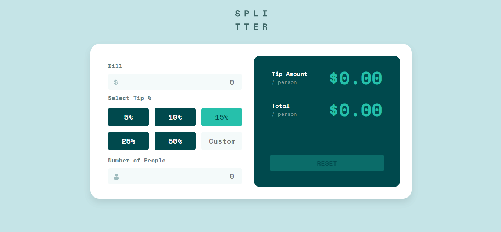

# Frontend Mentor - Tip calculator app solution

This is a solution to the [Tip calculator app challenge on Frontend Mentor](https://www.frontendmentor.io/challenges/tip-calculator-app-ugJNGbJUX). Frontend Mentor challenges help you improve your coding skills by building realistic projects.

## Table of contents

- [Screenshot](#screenshot)
- [Link](#link)
- [Built with](#built-with)
- [Project Takeaways](#project-takeaways)

### Screenshot

### Link

Solution URL: [Click Here](https://matejgroombridge.github.io/Tip-Calculator-App/)

### Built with

- HTML5
- SCSS
- Javascript
- Desktop First Workflow
- I used this video for help with the Javascript: https://www.youtube.com/watch?v=MkHR2PAsy3I&t=152s

### Project Takeaways

- Learnt how to use Javascript in a website project
- Learnt DOM Manipulation
- Learnt how to use Media Queries in CSS
- Better understanding of CSS and Javascript
- More problem solving skills gained
